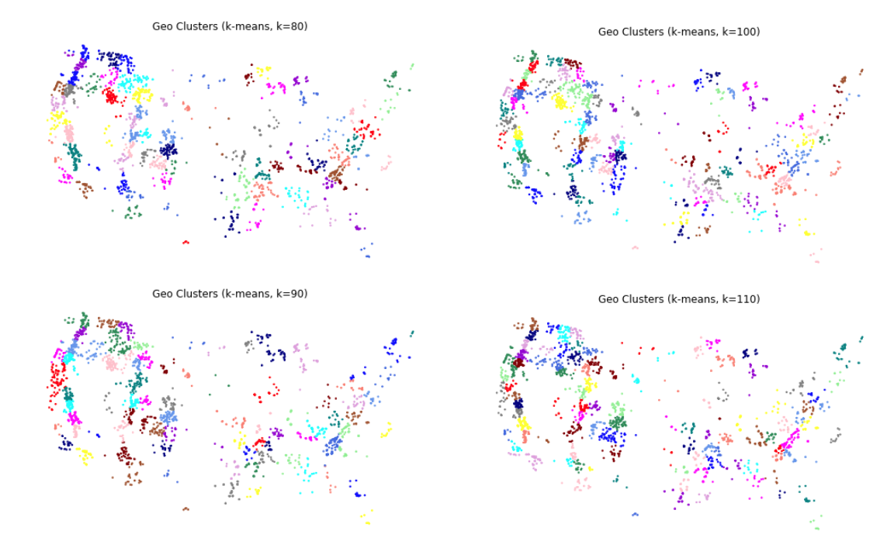

# 2020 Recreational Road Trips
## By Emily Hueni - July 2021

#### Time series map of travel to recreational sites
- green = number of people with reservations at recreational facility
- purple lines = volume of people traveling on a road to a recreational facility 

https://user-images.githubusercontent.com/13025142/126238503-7e666a0d-2490-488a-8395-b7e37672000f.mp4


## Background and Questions

Over the last year, interest in outdoor activity dramatically increased due to the pandemic.  In addition, many people – in an effort to maintain social distancing – were reluctant to travel by plane for vacationing purposes.  As a result, 2020 saw a large influx in cross-country road trippers traveling to various public parks and lands to escape from daily pandemic life.  As one of these people myself, I became curious about the flow patterns across the country of people traveling for recreational purposes.  In particular, I wanted to know where people were coming from, where were they going to, and when were they choosing to travel.  Can I identify patterns within the network that help me understand the trip planning lifecycle of Americans?  


## The Data

To answer my questions, I turned to the recreation.gov reservation data for the year 2020.  This data can be downloaded in bulk as a csv file and it contains approximately 5M reservation records for the year.  Each reservation contained information about the destination location (name, park, lat/longs), and the origin of the party making the reservation (zip code, number of people).  

I limited my search to only origin AND destination trips within the continental US and I dropped any rows that did not have origin zip code information, or whose zip code data did not easily join with my existing spatially enabled zip code table.   Approximately 3M observations remained in the dataset.

To understand flow networks of road trippers, I also needed free data relating to road networks across the US.  The obvious answer to this is Open Street Maps data, which along with being free, is remarkably high quality and has a pre-cleaned topology. 
 
Finally, US zip code data was used to correlate the rec.gov data to a geospatial location.


## Assumptions and Disclaimer

There are several known assumptions being made in this project around road trip behavior.  Some of these assumptions are likely incorrect at least some of the time.  Below is an outline of the assumptions made, the justifications for making them, and whether they likely hold true.

1.	People are mostly driving to their destinations – For this year this is likely true because the pandemic made air travel somewhat unappealing. Additionally, when camping or going to the outdoors, it is common for people to need gear and driving tends to be conducive to traveling with equipment.

2.	People are only going from their origin to their destination and not visiting multiple destinations in one trip.  I know this to be a false assumption. Many people will visit multiple locations for a national parks tour or longer trip.  However, because I do not know the details of their trips, for now I am just going with this assumption.

3.	People are taking the fast route between origin and destination.  Once again, I know that this is a false assumption. Many people will take indirect routes when road tripping – especially when seeking out scenic routes for their trip.  Nevertheless, I am assuming that most people have limited time off and want to get to their destination as fast as possible.  

Considering these assumptions and that this was a personal project done for fun please do not take the conclusions of this work too seriously or base important decisions from this analysis.  


## Processing Environment

AWS services were used for as much of the processing as possible. A postgres RDS instance with PostGIS and PGRouting extensions was set up in the cloud and used for the route calculations.  AWS Batch was also utilized for the python parallel processing in bulk of the time series images.

OGR2OGR command line scripting loaded all of the data into the RDS instance.  

Python 3.8 in a docker container was utilized for exploratory data analysis, applying unsupervised learning algorithms, and the final data visualization creation and analysis.  Packages used for this project include pandas, numpy, sklearn, vaex, geopandas, and rasterio.


## Exploratory Data Analysis
Exploratory data analysis revealed that the reservations within this dataset were limited to January of 2020 through September of 2020.  I suspect that the downloadable dataset for rec.gov’s 2021 data will include the information for the remainder of the year.  Although I aspire to do it in the future, at this time multi-year analysis is outside of the scope of this project.

Examining the trip information (a trip being defined as an origin point in a zip code and a destination point at a rec.gov facility) for the dataset revealed that there were approximately 690K unique possible routes that would need to be created to understand the flow of recreation related road trips throughout the year.

## Feature Engineering Workflow of Road Trip Networks
Being interested in the flow of people over time from their starting location to their destination, the first thing I needed was a quality road network on a large scale.  Open Street maps provides a road network within its lines dataset that is part of downloadable PDF file for all the US.  The full packaged when downloaded is over 7+ gigs.  Using OGR2OGR and sql where statements to select only the lines table and within that, only the data that is needed, I was able to upload a set of lines representing the major and semi-major roads across most of the US to my RDS postgres instance.  The resulting lines table contained over 2.5M rows.

```
ogr2ogr -sql "SELECT * FROM lines WHERE lines.highway='motorway' or lines.highway='motorway_link' or lines.highway='primary' or lines.highway='primary_link' or lines.highway='secondary' or lines.highway='secondary_link' or lines.highway='tertiary' or lines.highway='tertiary_link' or lines.highway='trunk'" -f PostgreSQL PG:"host=xxxxxxxxxxx.rds.amazonaws.com port=5432 user='xxxxx' password='xxxxxxx' dbname='postgres'" "us-latest.osm.pbf" --config OSM_MAX_TMPFILE_SIZE 1024
```

Basic post processing of the data from here included calculating a new field for estimated travel time along each line (based on type of road and length of segment) and data type cleanup for various columns.

Using the PGRouting extension within my postges rds database, the OSM lines were transformed into a functioning topology.  Once the network was enabled, I used the PGR function dijkstra to minimize the cost (travel time) and find the shortest path between two designated nodes.   When testing this algorithm on calculating 5 trips, I quickly realized that the algorithm was expensive and that it would not be feasible to run it on the 690k unique trips.  

Considering that I was only interested in the general flow network of people recreating on a national level I realized that I did not need the level of detail provided by the 690k unique routes.  Rather I just generally needed to see where people were starting and ending.  To overcome this problem, I used spatial clustering algorithms to group geographic locations that are nearby each other.  This allowed me to group the tens of thousands of zip codes into 300 groups.   

#### Zip Code Clusters


Similarly, I clustered the rec locations that were near each other into 110 groups.  Combining the two results, I ended up with ~20k unique origin/destinations trips. A much more manageable number of routes to calculate.

#### Recreation Facility Clusters


Even though the route number was now a fraction of the original size, it was still very large considering that each route took about 10 seconds to calculate.  Parallel processing of the routes was needed to complete this task.  To do this, I first upgraded my rds instance to the option with the largest number of cpus available on AWS.  Working quickly (because time is money) I used python sqlalchemy to break the query up into chunks of calculating 20 routes at a time.  I then threw all of these smaller queries at the database to process as fast as possible in parallel.  Processing time for the dataset of 22k ended up being about a half hour… so not too bad.

The final step in processing the route data was to simplify the final route lines and to break them up into segments based on estimates of how far people are willing to drive each day on a roadtrip.  I then joined these likely routes back to the rec.gov table to bring routing and reservation data into a single table. 

## Visualization
After all of the data was cleaned and the feature engineering of the routes was completed, I turned towards visualizing the flows of people along the routes over time.   I decided to create a gif that stitched together images of the routes being traveled each day for all of 2020. Selecting for each day the reservation maker’s location (starting point, likely in transit route, or at their destination), I visualized this on a map using geopandas and rasterio.  The resulting video can be seen at the top of the page.


## Analysis and Initial Conclusions
The final visualization provided much initial insight into the flow of people for recreational purposes. Several initial conclusions made:
1.	The Easter egg roll in April is the largest single day reservation event that rec.gov manages and it draws people from all over the country.
2.	Locals – or people within a day’s driving distance – make up a large part of the reservations made on rec.gov.  This is especially evident when you see the pulsing effect for many of the popular locations that seems to center on weekend days. 
3.	Unsurprisingly we see an increase in rec.gov reservations up north as the weather warms.


## Future Work
This dataset has endless possibilities.  I would love to explore what this data can teach us about the peak seasons for different popular destinations vs the shoulder seasons.  I would also like to better understand the lifecycle of planning a trip which includes the date when the reservation is first made.  I would also like to geographically focus in on a single area – such as Colorado – and see the movement of Coloradans as they recreate.
